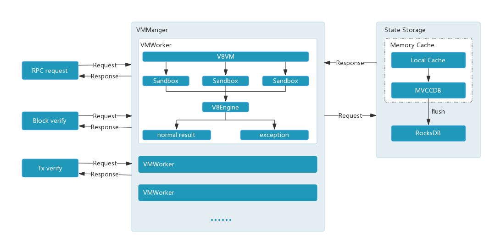
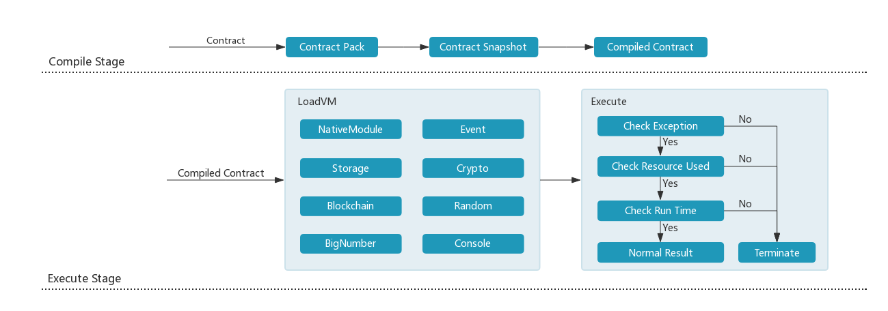

以太坊虚拟机（EVM）是一种“准图灵完整”的256位虚拟机，是以太坊网络最重要的组成部分之一。自以太坊以来，基于EVM的智能合约开发逐渐完善，并出现很多DApp应用，例如以太猫以及最近异常火爆的Fomo3D游戏等等。智能合约以及虚拟机的重要性已经得到了基本所有区块链开发者的认同，因此虚拟机的可用性、智能合约开发的便捷性已经成为各大公链竞争的主要赛道，同时也会决定一条公链最终能达到的高度。

### 一、以太坊虚拟机(EVM)并不图灵完备
网络上对以太坊虚拟机(EVM)有一种普遍的误解，就是认为以太坊虚拟机是图灵完备的，然而并非如此。

图灵机是阿伦图灵在1936提出的数学模型。图灵机包括一条无限长的纸带，一个字符表，一个读写头，一个状态寄存器，一个有限的指令集。运算开始时，图灵机读写头从某一位置开始按照此刻的配置(当前所处位置和当前格子内容等）来一步步的对照着指令集去进行操作，直到状态变为停止，运算结束。在计算领域，我们研究的一切问题都是计算问题，图灵完备意味着任意可计算问题都可以被解决。编程语言或虚拟机的本质都是一个图灵机，某种编程语言或者虚拟机是图灵完备意味着它可以做到图灵机能做到的所有事情，即可以解决所有的可计算问题。

而在以太坊虚拟机的设计中，因为指令的计算受到gas的约束，所以这就限制了可完成的计算次数。这也是一种图灵不完备的常见原因，因为循环、递归或计算的有界导致程序保证终止，所以EVM上能运行的程序会受到很多限制，EVM并不是图灵完备的。

### 二、EVM的不合理设计
以太坊的EVM作为最早的准图灵完备的虚拟机，在开创了面向智能合约的DApp开发的同时，随着区块链应用越来越广泛，EVM最初的一些不合理设计逐渐显现，甚至有些设计会导致严重的安全问题。单就以太坊虚拟机层面，我们认为在设计层面和安全层面有以下这些问题：

#### 1.智能合约设计层面
* <font color="#0092ff">缺乏标准库支持：</font>EVM缺少完善的标准库支持，甚至最基本的string类型支持，在EVM中都很鸡肋，例如字符串拼接、切割、查找等等都需要开发者自己实现。带来的后果就是开发者需要关注更多非本身业务的零碎细节，不能专注本身业务开发。同时自行实现的类库可能会因为时间、空间复杂度太高，消耗大量无谓的gas，又或者开发者从开源项目中借鉴相关类库代码，但也会引入更多安全性方面的问题，加重合约代码审计的复杂度，亦是得不偿失。
* <font color="#0092ff">难以调试和测试：</font>EVM难以调试和测试，EVM除了能抛出OutOfGas异常之外，不会给开发者返回任何信息，无法打印日志、要做到断点、单步调试更是完全不可能。虽然event机制可以部分改善这个问题，但event机制的本身设计就决定了他不是一个优雅好用的调试工具。
* <font color="#0092ff">不支持浮点数：</font>EVM不支持浮点数，以太坊以Wei为最小单位，只有整数，不支持其他粒度的计量，这种设计避免了引入浮点数导致的精度问题，但开发者在实际开发中，为了表示一个eth变量，就会在变量后面跟很多0，导致代码维护极度复杂。同时不可否认，浮点数在特定的场景下，还是有很大的利用价值的，不能一刀切直接放弃引入。
* <font color="#0092ff">合约不能升级：</font>EVM不支持合约升级，合约升级是智能合约开发中的一个强需求，也是每一个合约开发者必须要考虑的问题，合约升级可以实现给现有合约打安全补丁、扩展现有合约功能等等。EVM完全不支持升级，开发者只能通过发布新合约来解决这个问题，费时费力。

#### 2.智能合约安全层面
* <font color="#0092ff">溢出攻击：</font>EVM的safeMath库不是默认使用，例如开发者对solidity的uint256做计算的时候，如果最终结果大于uint256的最大值，就会产生溢出变为一个很小的数，这样就产生了溢出漏洞。诸如BEC、SMT等相关币种都遭受过溢出攻击，带来了极度严重都后果，BEC溢出漏洞如下：
```javascript
function batchTransfer(address[] _receivers, uint256 _value) public whenNotPaused returns (bool) {
    uint cnt = _receivers.length;
    uint256 amount = uint256(cnt) * _value; // 此处发生溢出
    require(cnt > 0 && cnt <= 20);
    require(_value > 0 && balances[msg.sender] >= amount); // 溢出后require始终成立，产生漏洞
 
    balances[msg.sender] = balances[msg.sender].sub(amount);
    for (uint i = 0; i < cnt; i++) {
        balances[_receivers[i]] = balances[_receivers[i]].add(_value);
        Transfer(msg.sender, _receivers[i], _value);
    }
    return true;
}
```
* <font color="#0092ff">重入攻击：</font>solidity一大特性是可以调用外部其他合约，但在将eth发送给外部地址或者调用外部合约的时候， 需要合约提交外部调用。如果外部地址是恶意合约，攻击者可以在Fallback函数中加入恶意代码，当发生转账的时候，就会调用Fallback函数执行恶意代码，恶意代码会执行调用合约的有漏洞函数，导致转账重新提交。最严重的重入攻击发生在以太坊早期，即知名的DAO漏洞。下面合约片段具体阐述了重入攻击：
```javascript
contract weakContract {
    mapping (address => uint) public balances;
    ...... // 其余合约代码
    function withdraw() {
        // 将调用者的余额转出，然后将调用者的余额map设置为0
        // ！！！只要没有执行余额map设置为0，就可以一直调用msg.sender进行转账，在这里进行重入
        if (!msg.sender.call.value(balances[msg.sender])()) {
            throw;
        }
        balances[msg.sender] = 0;
    }
    ..... // 其余合约代码
}
 
contract attack{
    weakContract public weak;
    ...... // 其余代码
    // 该函数为Fallback函数，外部调用转账的时候会触发，会一直触发调用weakContarct的withdraw方法，进行重入攻击
    function () payable {
        if (weak.balance >= msg.value) {
            weak.withdraw();
        }
    }
    ...... // 其余代码
}
```
* <font color="#0092ff">非预期函数执行：</font> EVM没有严格检查函数调用，如果合约地址作为传入参数可控，可能导致非预期行为发生。具体如下：
```javascript
contract A {
     function withdraw(uint) returns (uint);
}

// 执行B合约时，只会检查A合约是否有withdraw方法，如果有就会正常调用合约。
// 如果转入的a形参没有withdraw方法，a的Fallback函数就会别调用，导致非预期行为发生。

contract B {
    function put(A a){ a.withdraw(42);
}
```

### 三、现象级公链EOS的明显问题
EOS是继以太坊之后，又一现象级的公链应用，有自己独立的一套基于WebAssembly的智能合约引擎，但目前EOS合约开发有如下几个明显问题：

* <font color="#0092ff">账户系统不友好：</font>创建账户操作难度大，创建账户后才能发布合约，EOS需要使用已有账户去创建新账户，寻找一个拥有EOS账户的朋友或第三方，对任何人来说都不是一件很容易的事。创建账号需要购买RAM，就是需要花钱建账号，如果找第三方帮忙创建账号存在资金风险。创建账号后，还需要抵押EOS换取CPU使用时间和net带宽，才能在EOS网络做操作。这些操作对于开发者来说过于繁琐。
* <font color="#0092ff">RAM价格：</font>RAM价格昂贵，合约运行必须用到RAM，EOS开通了RAM市场，用于交易内存，虽然说RAM可以买卖，但依然存在很多人炒作，导致RAM价格昂贵。
* <font color="#0092ff">开发难度大：</font>使用C++作为合约开发语言，极大的提高了合约开发门槛，C++本身就极为复杂，在其上还要去调用EOS.IO C++ API完成智能合约开发，对开发者的个人能力要求极高。

因此面对种种可列举的问题，EOS智能合约开发对于开发者吸引力不大，甚至会成为开发者放弃EOS的理由。

### 四、IOST虚拟机的诞生
我们认为一个良好的虚拟机实现必须在做到架构设计优雅的同时满足易用性和安全性的需求，在经过对比参考EVM、EOS、C Lua、V8等相关虚拟机的优缺点之后，我们从根源上解决了很多EVM和EOS不合理性设计与问题，并且基于V8在NodeJs和Chrome上的优异表现，最终构建了基于V8的IOST虚拟机。

#### 1. IOST V8VM架构与设计

V8VM架构的核心是<font color="#0092ff">VMManger</font>，主要有如下三个功能：



* <font color="#0092ff">VM入口，</font>对外接收其他模块的请求，包括RPC请求、Block验证、Tx验证等等，预处理、格式化后交给VMWorker执行。
* <font color="#0092ff">管理VMWorker生命周期，</font>根据当前系统负载灵活设置worker数量，实现worker复用；同时在worker内部实现了JavaScript代码热启动、热点Sandbox快照持久化功能，减少了频繁创建虚拟机、频繁载入相同代码引发的高负载、内存飙升问题，降低系统消耗的同时，又极大的提高了系统吞吐量，使得IOST V8VM在处理fomo3D这种典型的海量用户合约时游刃有余。
* <font color="#0092ff">管理与State数据库的交互，</font>保证每一笔IOST交易的原子性，在合约执行出错，或者gas不足的情况下，能够回退整个交易。同时在State数据库中，也是实现了两级内存缓存，最终才会flush到RocksDB中。

#### 2. Sandbox核心设计



Sandbox作为最终执行JavaScript智能合约的载体，对上承接V8VM，对下封装Chrome V8完成调用，主要分为Compile阶段和Execute阶段：

> Compile阶段
主要面向合约开发和上链，有如下两个主要功能：
* <font color="#0092ff">Contract Pack，</font>打包智能合约，基于webpack实现，会打包当前合约项目下的所有JavaScript代码，并自动完成依赖安装，使IOST V8VM开发大型合约项目变成可能。同时IOST V8VM和Node.js的模块系统完全兼容，可以无缝使用require、module.exports和exports等方法，赋予合约开发者原生JavaScript开发体验。
* <font color="#0092ff">Contract Snapshot, </font>借助v8的snapshot快照技术，完成对JavaScript代码的编译，编译后的代码提升了Chrome V8创建isolate和contexts的效率，真正执行时只需要反序列化快照就可以完成执行， 极大的提高了JavaScript的载入速度和执行速度。

> Execute阶段
主要面向链上合约真正执行，有如下两个主要功能：
* <font color="#0092ff">LoadVM，</font>
完成VM初始化，包括生成Chrome V8对象、 设置系统执行参数、导入相关JavaScript类库等等，完成智能合约执行之前的所有准备工作。部分JavaScript类库如下：

| 类库          | 功能   |
| --------     | -----  |
| Blockchain   | 类Node.js的模块系统，包括模块缓存、模块预编译、模块循环调用等等。 |
| Event        | JavaScript对State数据库的读写，并在合约执行失败或者出现异常的时候完成回退。   |
| NativeModule | 区块链相关功能函数实现，包括transfer、withdraw以及获取当前block、当前tx信息。    |
| Storage      | 事件实现，JavaScript合约内部对event的调用在完成上链后都可以得到回调。    | 

* <font color="#0092ff">Execute，</font>
最终执行JavaScript智能合约，IOST V8VM会开辟单独的线程执行合约，并监控当前执行状态，当发生异常、使用资源超过限制、执行时间超过最大限制时，会调用Terminate结束当前合约执行，返回异常结果。

#### 3. IOST V8VM性能表现
我们认为作为公链最核心的底层设施，虚拟机必须在性能上表现足够优异。IOST在设计、虚拟机选型之初，就把性能作为最重要的指标之一。

Chrome V8使用JIT、内联缓存、惰性加载等方式实现JavaScript的解释执行，得益于Chrome V8的高性能，IOST V8VM的JavaScript执行速度有了质的提升。我们在<font color="#0092ff">递归fibonacci、内存拷贝、复杂cpu运算</font>这三个方面，分别测试了<font color="#0092ff">EVM、EOS、C Lua和V8VM</font>的性能，具体结果如下：

* 测试系统环境

| 属性  | 配置   |
| --------     | -----  |
| System  | AWS EC2   |
| CPU     | 2 CPU  |
| Memory  | 8GB |

* 测试结果

|   				  	| evm    | lua c    | eos.binaryen | eos.wavm  | IOST V8VM|
| --------     		  	| -----  |   -----  | --------     | --------  | -------  |
| cpu calculate (8000)	| 92 ms  | 6.34 ms  | 3.34 ms 	   | 10.28 ms  | 6.26 ms  |
| fibonacci (32)     	| 8.25 s | 	470 ms  | 5.5 s  	   | 541 ms    | 45 ms    |
| string concat (10000) | 2.18 s | 370 ms   | 316 ms  	   | 96.3 ms   | 9.3 ms   |

实测IOST V8VM在主流VM实现中，性能表现优异。上述测试包含了虚拟机启动和加载配置的时间，可见IOST V8VM直接冷启动也有不少的性能优势，后续我们还会加入VM对象池、LRU缓存等等，来提升虚拟机CPU、内存使用率，以更好提升IOST处理智能合约的能力

#### 4. 结语

目前我们已经完成了IOST V8VM虚拟机第一版的开发，在第一版中，我们已经实现了所有预定的功能，在后续的迭代过程中，我们将把IOST V8VM的<font color="#0092ff">安全性、易用性</font>放在首位，并在如下三个方向不断努力：


高性能，保证合约更快的执行

开发上手更加简单，增加并完善更多标准库

支持大型项目构建，调试，有完善的工具链


同时在第一版IOST V8VM的开发中我们初步验证了很多想法，例如<font color="#0092ff">投票、合约域名、token</font>等等，更多的新功能、更多的新特性都会在接下来的测试网更新中逐步实现。

### 附录: 虚拟机benchmark程序

* 1.Evm Code

```javascript
package evm
 
import (
   "math/big"
   "testing"
 
   "github.com/ethereum/go-ethereum/accounts/abi/bind"
   "github.com/ethereum/go-ethereum/accounts/abi/bind/backends"
   "github.com/ethereum/go-ethereum/common"
   "github.com/ethereum/go-ethereum/core"
   "github.com/ethereum/go-ethereum/crypto"
)
 
var bm *Benchmark
 
func init() {
   key, err := crypto.GenerateKey()
 
   auth := bind.NewKeyedTransactor(key)
   gAlloc := map[common.Address]core.GenesisAccount{
      auth.From: {Balance: big.NewInt(1000000)},
   }
   sim := backends.NewSimulatedBackend(gAlloc)
 
   _, _, bm, err = DeployBenchmark(auth, sim)
 
   if err != nil {
      panic(err)
   }
   sim.Commit()
}
 
func BenchmarkFibonacci(b *testing.B) {
   for i := 0; i < b.N; i++ {
      _, err := bm.Fibonacci(nil, big.NewInt(32))
      if err != nil {
         b.Fatalf("fibonacci run error: %v\n", err)
      }
   }
}
 
func BenchmarkStrConcat(b *testing.B) {
   for i := 0; i < b.N; i++ {
      _, err := bm.StrConcat(nil, "This is vm benchmark, tell me who is slower", big.NewInt(10000))
      if err != nil {
         b.Fatal(err)
      }
   }
}
 
func BenchmarkCalculate(b *testing.B) {
   for i := 0; i < b.N; i++ {
      _, err := bm.Calculate(nil, big.NewInt(5000))
      if err != nil {
         b.Fatal(err)
      }
   }
}
```

* 2.Lua Code

```javascipt
function fibonacci(number)
    if number == 0
    then
        return 0
    end
 
    if number == 1
    then
        return 1
    end
 
    return fibonacci(number - 1) + fibonacci(number - 2)
end
 
function strConcat(str, cycles)
    local result = ""
    for i = 1, cycles do
        result = result .. str
    end
 
    return result
end
 
function calculate(cycles)
    local rs = 0
    for i = 0, cycles-1 do
        rs = rs + math.pow(i, 5)
    end
 
    return rs
end
```

* 3.EOS code

```javascipt
class fibonacci : public eosio::contract {
public:
    using contract::contract;
 
    /// @abi action
 void calcn(int64_t n) {
      int64_t r = calc(n);
      print(r);
   }
    int calc( int64_t n ) {
      if (n < 0)
      {
          return -1;
      }
      if (n == 0 || n == 1)
      {
          return n;
      }
      return calc(n - 1) + calc(n - 2);
    }
};
 
EOSIO_ABI( fibonacci, (calcn) )
 
 
class stringadd : public eosio::contract {
public:
    using contract::contract;
 
    /// @abi action
 void calcn(std::string s, int64_t cycles) {
      std::string ss(s.size() * cycles, '\0');
      int32_t k = 0;
      for (int i = 0; i < cycles; ++i)
      {
         for (int j = 0; j < s.size(); ++j)
         {
            ss[k++] = s[j];
         }
      }
      print(ss);
   }
};
 
EOSIO_ABI( stringadd, (calcn) )
 
 
class calculate : public eosio::contract {
public:
    using contract::contract;
 
    /// @abi action
 void calcn(uint64_t cycles) {
      uint64_t rs = 0;
      for (uint64_t i = 0; i < cycles; ++i)
      {
         rs = rs + i * i * i * i * i;
      }
      print(rs);
   }
};
 
EOSIO_ABI( calculate, (calcn) )
```